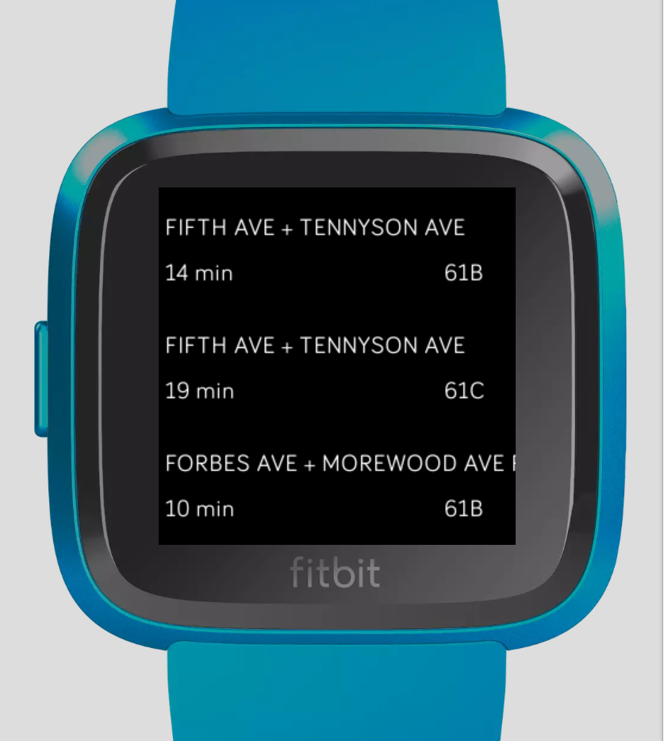
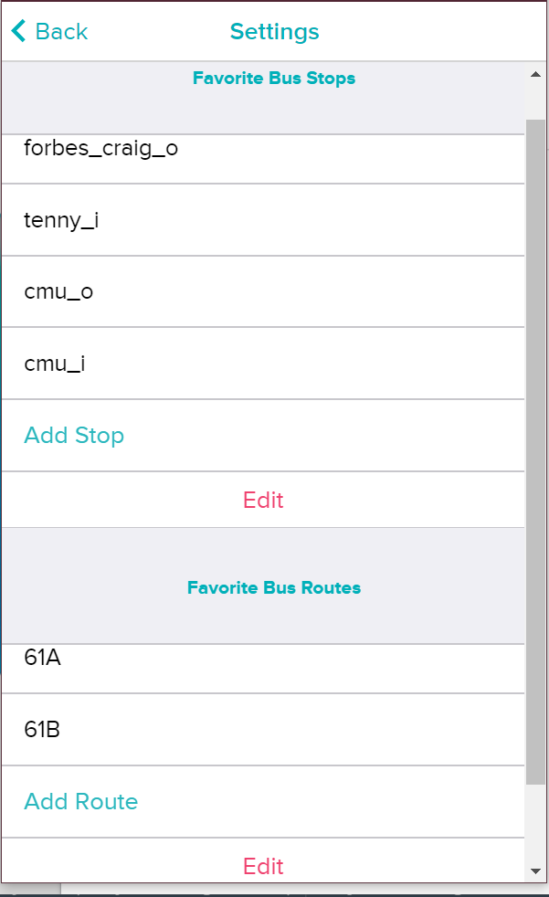

# Pittsburgh Transit on Fitbit
Transit-like app for Fitbit

Adapted from https://github.com/Fitbit/sdk-bart

BusTime Port Authority API http://realtime.portauthority.org/bustime/apidoc/docs/DeveloperAPIGuide3_0.pdf

Currently only supports limited number of stops. 

Future plans to include:
- support for selecting different default stops and default routes

Screenshots:

